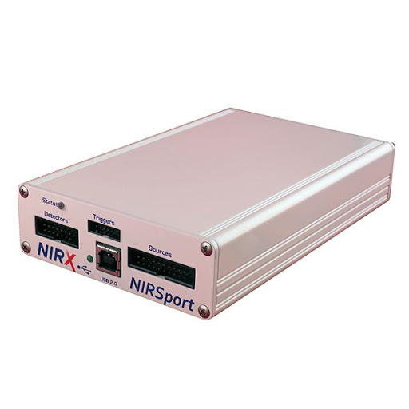

# Functional Near-Infrared Spectroscopy (fNIRS)

## NIRSPort 88 system (NIRX Medical Technologies, Inc.)

We have a NIRX nirsport88 mobile system, which no longer appears on the Nirx website.

Nevertheless, everything needed (data acquisition & analysis software, support, training) can be found on the NIRx website: 
https://nirx.net/

1. download analysis software & and read manual
- https://nirx.net/software
- https://nirx.net/nirslab-1
- NITRC site (where you'll actually download): https://www.nitrc.org/frs/?group_id=651

As you read the manual, try it out with real data (e.g., nirx.net has some data sets you can download if needed).

2. read this document on cortical functions for background on localizing Brodmann areas we'll be recording from using the International 10-20 system used in EEG
- https://thebrainstimulator.net/docs/external/Trans_Cranial_Technologies-cortical_functions_ref_v1_0.pdf

Also very helpful: Wikipedia page on Brodmann areas (w. hyperlinks to each area): 
https://en.wikipedia.org/wiki/Brodmann_area
- Provides summary of functions along with references for each brodmann area, and usually an image showing the region

TO ADD:
1. need note on how to examine probe layouts in nirslab

## fNIR Devices Imager 1000 (from fNIR Devices/Biopac)

